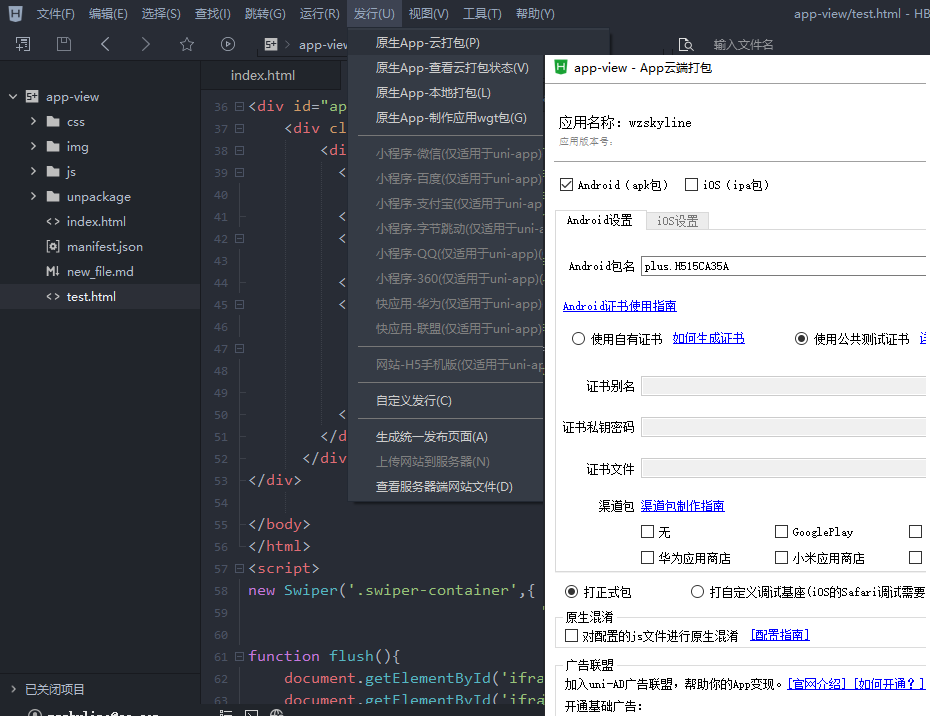
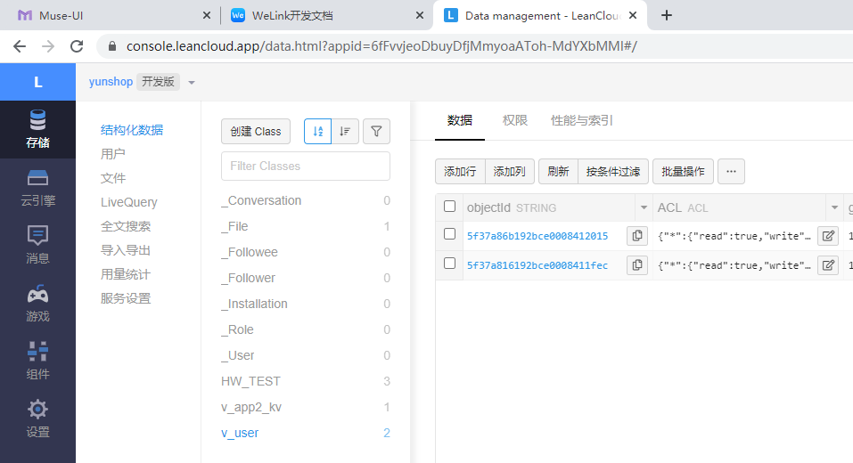

## uniapp + leancloud 空闲时间构建小运用 

### uniapp 实现你简单页面打包成手机apk文件  
1. 官网下载idea https://uniapp.dcloud.io/quickstart  
2. 新建模板进行 打包  
 
### leancloud 实现简单数据存储
不需要后端开发接口,leancloud 的sdk函数就是数据接口  
注册后创建应用 获取key值  
1. 应用地址 https://console.leancloud.app/applist.html#/apps  
2. 文档地址 https://leancloud.cn/docs/leanstorage_guide-js.html WZlove123  
设置>应用Keys > AppID +AppKey 
来实例化 我封装的 leancloud.js 里面 AV 对象
AV.init("MW9UfmNmX0phVCcw2YCPQmye-MdYXbMMI","XslNotJgRdIcWVdNlTTWtCAv"); // 你的应用key值 
应用引入av-min.js及可进行 leancloud 数据存储  

-----
ps: MD 本地预览的方法 vscode 按 ctrl + shift + v

 

 
